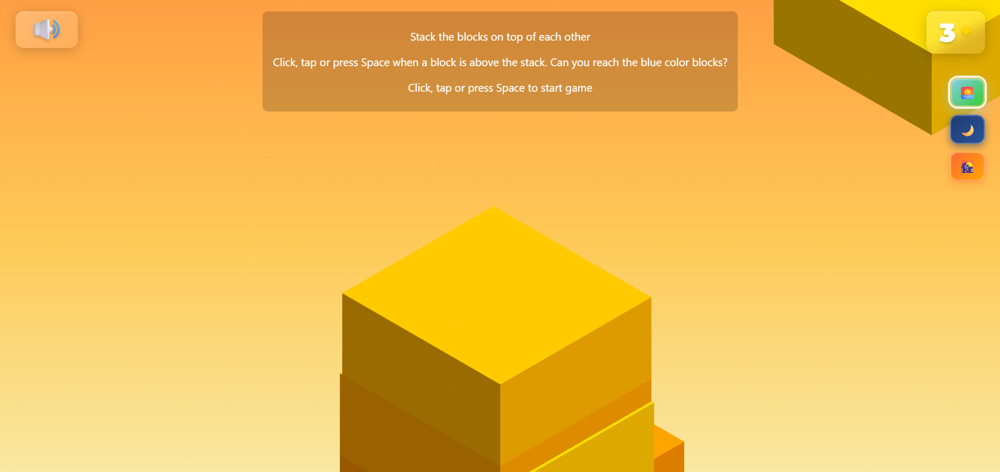
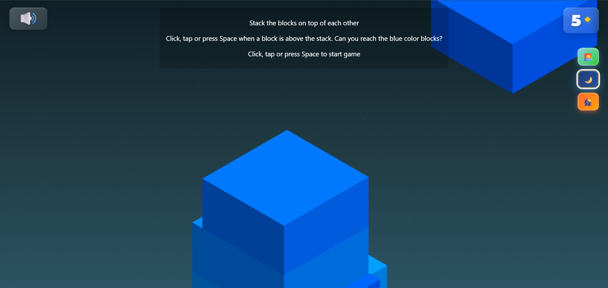

# 🧱 3D Blockstack Game

> A mesmerizing 3D stacking game built with Three.js, featuring realistic physics, responsive design, and addictive gameplay mechanics.

[](https://opensource.org/licenses/MIT)
[](https://threejs.org/)
[](CONTRIBUTING.md)
[](https://3d-blockstack.vercel.app/)

---

## 🎮 Demo

## Light Theme

## Dark Theme


*Stack blocks with precision and watch them fall with realistic physics!*

---

## 🚀 Quick Start

### Prerequisites
- A modern web browser (Chrome, Firefox, Safari, Edge)
- No additional software required!

### Installation

1. **Clone the repository**
   ```bash
   git clone https://github.com/maitri-vv/3D-Blockstack.git
   cd 3D-Blockstack
   ```

2. **Open the game**
   ```bash
   # Option 1: Simple file opening
   open index.html
   
   # Option 2: Local server (recommended)
   python -m http.server 8000
   # Then visit http://localhost:8000
   ```

3. **Start playing!** 🎯

---

## 🎯 How to Play

### Controls
- **Desktop**: Click mouse or press `Space` to drop blocks
- **Mobile**: Tap screen to drop blocks
- **Restart**: Press `R` key or tap after game over

### Gameplay
1. **Stack blocks** on top of each other with perfect timing
2. **Watch blocks fall** with realistic physics when you miss
3. **Build higher** - each successful stack increases your score
4. **Challenge yourself** to reach the blue-colored blocks
5. **Beat your high score** - progress is automatically saved!

### Scoring
- Each successfully stacked block = +1 point
- High score is automatically saved in your browser
- Can you reach 20+ blocks? 🏆

---

## 🛠️ Technology Stack

| Technology | Purpose | Version |
|------------|---------|---------|
|  | 3D rendering and scene management | r128 |
|  | Realistic physics simulation | 0.6.2 |
|  | Smooth animations and transitions | 18.6.4 |
|  | Game structure and UI | 5 |
|  | Responsive design and animations | 3 |
|  | Game logic and interactions | ES6+ |

---

## ✨ Features

- 🎨 **Beautiful 3D Graphics** - Gradient backgrounds and particle effects
- 📱 **Responsive Design** - Works perfectly on desktop, tablet, and mobile
- ⚡ **Realistic Physics** - Blocks fall and interact naturally
- 🎯 **Precise Controls** - Mouse, keyboard, and touch support
- 💾 **High Score System** - Local storage saves your best performance
- 🌟 **Visual Effects** - Ring effects, particle systems, and smooth animations
- 🎵 **Smooth Animations** - TWEEN.js powered transitions
- 🔄 **Auto-restart** - Seamless game restart functionality
- 📊 **Score Tracking** - Real-time score display with diamond indicators

---

## 🎨 Game Mechanics

### Block Physics
- **Realistic falling** with Cannon.js physics engine
- **Collision detection** for precise stacking
- **Mass calculation** based on block size
- **Gravity simulation** for natural movement

### Visual Effects
- **Gradient backgrounds** with custom canvas textures
- **Particle systems** for ambient atmosphere
- **Ring effects** on successful stacks
- **Smooth camera movement** following the tower

### Responsive Design
- **Adaptive box sizing** based on screen dimensions
- **Touch-optimized** controls for mobile devices
- **Cross-platform** compatibility
- **High DPI** support for crisp rendering

---

## 🤝 Contributing

I welcome contributions! Here's how you can help:

### 🐛 Bug Reports
- Use the [GitHub Issues](https://github.com/maitri-vv/3D-Blockstack/issues) tab
- Include steps to reproduce the issue
- Specify your browser and device type

### 💡 Feature Requests
- Open an issue with the "enhancement" label
- Describe the feature and its benefits
- Consider the impact on mobile users

### 🔧 Code Contributions
1. **Fork** the repository
2. **Create** a feature branch (`git checkout -b feature/amazing-feature`)
3. **Commit** your changes (`git commit -m 'Add amazing feature'`)
4. **Push** to the branch (`git push origin feature/amazing-feature`)
5. **Open** a Pull Request

### 📋 Development Guidelines
- Follow existing code style and patterns
- Test on both desktop and mobile devices
- Ensure responsive design compatibility
- Add comments for complex physics calculations

---

## 🎯 Roadmap

- [ ] **Sound Effects** - Audio feedback for stacking and falling
- [ ] **Power-ups** - Special blocks with unique properties
- [ ] **Multiplayer Mode** - Compete with friends in real-time
- [ ] **Custom Themes** - Different visual styles and colors
- [ ] **Achievement System** - Unlock badges for milestones
- [ ] **Leaderboards** - Global high score competition

---

## 🙏 Credits & Attribution

### Libraries & Frameworks
- **[Three.js](https://threejs.org/)** - 3D graphics library
- **[Cannon.js](https://github.com/schteppe/cannon.js/)** - Physics engine
- **[TWEEN.js](https://github.com/tweenjs/tween.js/)** - Animation library

### Inspiration
- **Stack by Ketchapp** - Original stacking game concept
- **Community tutorials** - Three.js and Cannon.js learning resources

### Fonts
- **Montserrat** - Beautiful typography from Google Fonts

---

## 📄 License

This project is licensed under the **MIT License** - see the [LICENSE](LICENSE) file for details.

---

## 👨‍💻 Author & Maintainer

**[Maitri V V](https://github.com/maitri-vv)**
🎮 Developer & Designer of *3D Blockstack*

📫 **Reach me at:**

* GitHub: [@maitri-vv](https://github.com/maitri-vv)
* LinkedIn: [maitrivaghasiya](https://linkedin.com/in/maitrivaghasiya)
* Twitter: [maitrivv](https://twitter.com/maitrivv)

---

## 📄 We're Still Playing! Shoutout to the Amazing Contributors Who Secured the Win.

<a href="https://github.com/maitri-vv/3S-Blockstack/graphs/contributors">

</a>

---
## ⭐ Show Your Support

If you enjoyed this game, please give it a ⭐ on GitHub!

---

<div align="center">

**Made with ❤️ and lots of ☕**

*Happy Stacking! 🧱*

</div>